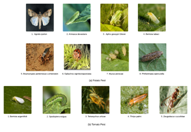

# Smart Farming with MCPNet 🌱🐛
*A Hybrid Deep Learning Framework for Multi-Crop Pest Detection*  
Accepted at **5th International Conference on Applied Intelligence and Informatics (AII 2025)**  
To be published in **Springer-Nature CCIS Proceedings**

---

## 📌 Overview
This repository accompanies our accepted paper:

**"Smart Farming with MCPNet: A Hybrid Deep Learning Framework for Multi-Crop Pest Detection"**  
Authors: Nadim Ahmed, Md. Ashraful Babu, Zarif Wasif Bhuiyan, Md. Mortuza Ahmmed, M. Mostafizur Rahman, Mufti Mahmud  

### 🔑 Key Contributions
- Introduces **MCPNet**, a hybrid deep learning framework tailored for **multi-crop pest detection**.  
- Achieves **99% accuracy** on a large-scale dataset of **13,000 images across 13 pest classes**.  
- Balances **scalability, real-time feasibility, and generalization** compared to heavier baselines.  
- Demonstrates strong potential for **sustainable smart farming** and agricultural automation.  

---

## 🖼️ Representative images of various pests in dataset

  

## 🖼️ Model Architecture of MCPNet

  

---
